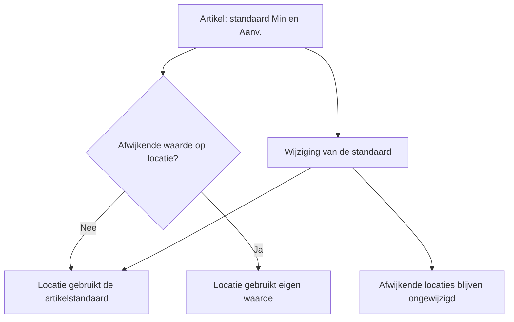
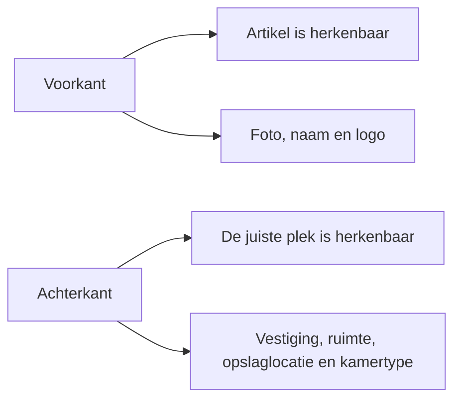
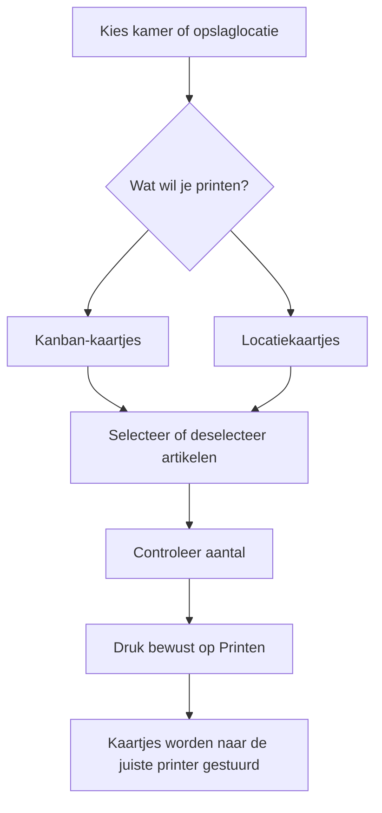

# Wat komt er in Kanban Beheer?

## Kort samengevat

Kanban Beheer wordt uitgebreid met twee soorten materiaal:

- **Kanban-materiaal**: materiaal dat wordt aangevuld wanneer de voorraad laag is.
- **Standaard materiaal**: materiaal dat op een bepaalde plek aanwezig hoort te zijn, zoals een pulseoximeter of naaldencontainer.

Daarnaast krijgt ieder artikel een herkenbaar **Locatiekaartje**. Daarmee is in één oogopslag te zien welk artikel op welke plek hoort te liggen.

De uitbreiding blijft bewust eenvoudig in gebruik. Op zowel kamer- als opslaglocatieniveau komen twee aparte knoppen: **Kanban-kaartjes** en **Locatiekaartjes**.

## Wat wordt er gemaakt?

De openstaande werkzaamheden vallen uiteen in deze onderdelen:

1. **Materiaal en instellingen** — Kanban- en Standaard materiaal vastleggen, met een standaard per artikel en eventuele afwijkingen per locatie.
2. **Omzetting van bestaande instellingen** — de huidige voorraadinstellingen veilig omzetten naar Min en Aanv., zonder oude waarden stilzwijgend verkeerd te interpreteren.
3. **Locatiekaartjes** — kaartjes aanmaken, bij wijzigingen verouderen en opnieuw kunnen printen.
4. **Printen vanuit de applicatie** — op kamer- en opslaglocatieniveau kaartjes selecteren, artikelen uitschakelen en de juiste printopdracht starten.
5. **Printerkoppeling en controle** — de bestaande Kanban-printerroute aanpassen voor Min/Aanv., een aparte A4-route voor Locatiekaartjes maken en het resultaat zowel geautomatiseerd als fysiek controleren.

## Waarom is dit nodig?

Niet ieder artikel werkt volgens hetzelfde voorraadprincipe. Een Kanban-artikel vraagt om een aanvulregel; bij een standaardartikel is vooral belangrijk dat het aanwezig is.

Ook is in de praktijk niet altijd duidelijk waar een artikel precies hoort te liggen. Een Locatiekaartje maakt de combinatie van artikel en locatie zichtbaar en helpt om materialen na gebruik weer op de juiste plek terug te leggen.

## De nieuwe voorraadinstellingen

Voor Kanban-materiaal gebruiken we voortaan twee begrippen:

- **Min**: vanaf welk niveau aanvullen nodig is.
- **Aanv.**: hoeveel stuks er daarna worden aangevuld.

Het oude begrip **Max** verdwijnt. Een voorbeeld:

> Min 2 en Aanv. 3 betekent: bij een lage voorraad worden 3 stuks aangevuld. De voorraad komt daarmee uit op 5 stuks.

Voor Standaard materiaal worden geen Min- of Aanv.-waarden gebruikt.

### Eén standaard per artikel, uitzonderingen per locatie

Een artikel krijgt een standaardwaarde voor Min en Aanv. Die standaard geldt automatisch op alle locaties waar geen afwijking nodig is.

Als een bepaalde kast of kamer een andere waarde nodig heeft, kan daar een lokale afwijking worden ingesteld. Alleen een werkelijk afwijkende waarde wordt als afwijking beschouwd.

De standaardwaarden worden beheerd bij het bestaande artikelbeheer. Bij een wijziging wordt vooraf getoond hoeveel locaties de nieuwe standaard zullen overnemen.

In de kamer- en opslaglocatieoverzichten blijven de waarden zelf rustig en herkenbaar. Alleen een werkelijk afwijkend getal krijgt een subtiele kleur en een klein instellingenicoon. De standaardwaarde is via een tooltip te bekijken.

## De nieuwe Locatiekaartjes

Een Locatiekaartje is een fysiek kaartje van **90 x 60 mm**. Er worden acht kaartjes op één A4-vel geprint, in kleur en dubbelzijdig.

### Voorkant

De voorkant is voor alle kamers hetzelfde en blijft neutraal. Er staan op:

- een grote foto van het artikel;
- de naam van het artikel;
- het bedrijfslogo;
- bij Kanban-materiaal: de Min-waarde;
- bij Standaard materiaal: geen voorraadgetal.

De Aanv.-waarde komt niet op het Locatiekaartje. Die staat wel op het Kanban-kaartje.

### Achterkant

De achterkant maakt duidelijk waar het kaartje thuishoort:

- Vestiging;
- Ruimte;
- Opslaglocatie;
- Kamertype en de bijbehorende kleur.

Er komen geen QR-code, SKU of andere technische codes op het Locatiekaartje.

## Kaartjes printen

Op ieder niveau kan de gebruiker zelf bepalen wat er geprint wordt:

- **Kanban-kaartjes** bevatten alleen Kanban-materiaal.
- **Locatiekaartjes** bevatten Kanban-materiaal en Standaard materiaal.
- Geldige artikelen staan vooraf aangevinkt.
- Een afzonderlijk artikel kan worden uitgeschakeld voordat de opdracht wordt verstuurd.
- Ontbreekt een verplichte foto of het bedrijfslogo, dan wordt alleen dat artikel overgeslagen met een duidelijke reden.
- De twee kaartsoorten worden bewust apart geprint: Kanban-kaartjes via de bestaande Badgy 200-route en Locatiekaartjes via de kleurenprinter voor A4.

Een wijziging van een instelling start nooit automatisch een print. Bestaande kaartjes worden wel als verouderd beschouwd; de gebruiker kan daarna bewust een nieuwe printopdracht starten.

## Wat betekent dit voor de beheerder?

- Bij nieuwe artikelen staat standaard **Min 1 / Aanv. 1** ingevuld.
- Bestaande Min/Max-instellingen worden eenmalig omgezet naar Min/Aanv.
- Per artikel wordt gekeken welke combinatie het vaakst voorkomt. Die wordt de nieuwe artikelstandaard.
- Bij een gelijke uitkomst wordt de combinatie met de laagste totale voorraad na aanvullen gekozen.
- Oude instellingen die niet logisch kunnen worden omgezet, moeten eerst worden gecontroleerd; de omzetting gaat dan niet stilzwijgend verder.
- Een wijziging van de artikelstandaard werkt automatisch door op locaties zonder afwijking.
- Lokale afwijkingen blijven behouden.
- Een positie die op Standaard materiaal staat, toont geen Kanban-instellingen.
- Bij het printen kan per kamer of opslaglocatie worden gekozen welke artikelen wel of niet meegaan.

## Wat betekent dit voor iemand die in een kamer werkt?

- Op iedere aangewezen plek is zichtbaar welk artikel daar hoort te liggen.
- Een Standaard materiaal-kaartje zegt vooral: **dit artikel hoort hier aanwezig te zijn**.
- Een Kanban-kaartje laat zien wanneer aanvullen nodig is en hoeveel er moet worden aangevuld.
- De achterkant helpt een kaartje terug te brengen naar de juiste kamer en opslaglocatie.
- De kleur van het Kamertype helpt bij snelle herkenning van de kamer, zonder dat de neutrale voorkant wordt veranderd.
- Er is geen extra scan- of bevestigingshandeling nodig nadat een kaartje is geprint.

## Wat wordt er achter de schermen voorbereid?

De beheerapplicatie krijgt geautomatiseerde tests voor de belangrijkste gebruikershandelingen. De twee printerroutes worden afzonderlijk voorbereid en getest. De A4-route wordt bovendien één keer op de echte kleurenprinter gecontroleerd, zodat formaat, kleur en uitlijning op het Avery-vel ook in de praktijk kloppen.

De bestaande Kanban- en Badgy 200-werkwijze blijft als aparte route behouden. De uitbreiding met Locatiekaartjes verandert die bestaande printer niet in een A4-printer en mengt de twee printopdrachten niet.
