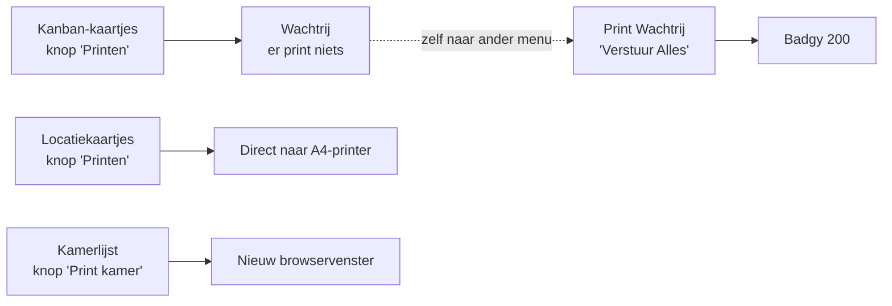
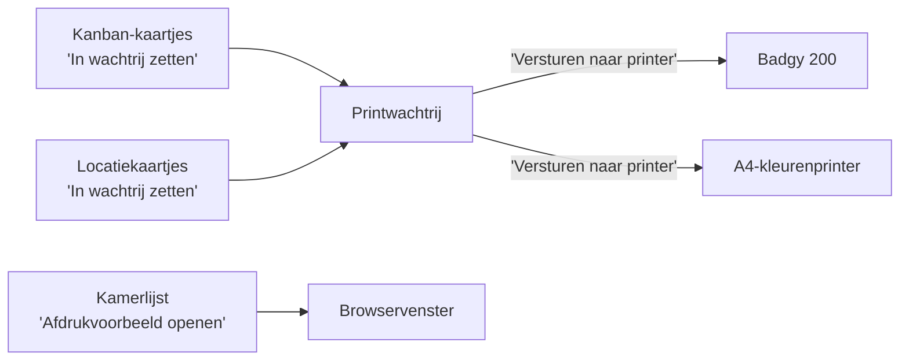

# UI/UX-review Vivaldi Kanban — rapport en werkplan

**Datum:** 2026-09-04 · **Laatst bijgewerkt:** 2026-09-04 · **Status:** werkdocument

---

## 0. Over dit document

### 0.1 Bronnen

Dit document voegt **twee onafhankelijke reviews** samen tot één werkbaar geheel:

| | Aanpak | Sterkte |
|---|---|---|
| **Review A** | Codegebaseerd: alle routes, sjablonen, queries en redirects doorgelopen | Exacte mechanismen en regelverwijzingen; vindt oorzaken achter symptomen |
| **Review B** | Live doorloop van de draaiende app op desktop/Safari, plus code, ADR's en issues | Vindt wat een gebruiker daadwerkelijk ervaart; sterk op taal en risico |

Ze bevestigen elkaar op de hoofddiagnose en vullen elkaar goed aan. Elke bevinding is gelabeld met
de bron — `[A]`, `[B]` of `[A+B]` — zodat traceerbaar blijft waar iets vandaan komt.

### 0.2 Hoe je dit document leest

| Markering | Betekenis |
|---|---|
| ✅ **BESLIST-n** | Beslissing is genomen en vastgelegd. Kan uitgevoerd worden |
| 🔶 **OPEN-n** | **Beslispunt dat nog openstaat.** Zie §2.3 voor de volledige lijst |
| ⚠️ | Risico of valkuil bij de uitvoering — niet overslaan |
| ❓ | Waarneming die **niet is geverifieerd**; eerst reproduceren |
| P0 / P1 / P2 | Blokkeert begrip of veroorzaakt fouten / kost onnodig tijd / afleiding |

Alles met een regelverwijzing is in de code geverifieerd. Waar iets níet is geverifieerd, staat
dat er met ❓ bij.

### 0.3 Snelle navigatie

- **Wil je weten wat er beslist moet worden?** → §2.3
- **Wil je weten waar we naartoe werken?** → §3
- **Wil je aan de slag?** → §6 (werkplan) en §7 (bestandsimpact)

---

## 1. Hoofdconclusie

Beide reviews komen onafhankelijk op dezelfde diagnose:

> **`Mijn kamers` is de natuurlijke hoofdingang voor een assistente. `Opslaglocaties` is een tweede,
> concurrerende navigatiestructuur over exact dezelfde gegevens, met minder functies en minder
> context. Die moet weg.**

Daarnaast: **"printen" betekent in deze app drie verschillende dingen** — een wachtrij vullen,
direct naar de A4-printer sturen, of een browservenster openen — achter knoppen die er hetzelfde
uitzien.

Een volledige herbouw is niet nodig. Het gaat om drie dingen:

1. **één hoofdroute aanwijzen**,
2. **acties voorspelbaar maken**,
3. **consequent taalgebruik**.

Concreet resultaat: het Assistente-menu krimpt van 6 naar 4 items, en er ontstaat **één werkstroom
voor alles wat op papier moet**.

---

## 2. Beslissingen

### 2.1 ✅ Genomen beslissingen

| | Beslissing | Gevolg |
|---|---|---|
| **BESLIST-1** | `Mijn Ruimtes` (nu nog `Mijn Kamers`) wordt canoniek; **beide opslaglocatiepagina's verdwijnen** | Menu-item weg, oude URL's gaan doorverwijzen. Zie fase 2 |
| **BESLIST-2** | **Kamerlijst wordt een knop op de kamerpagina**; het menu-item en het bedrijfsbrede overzicht vervallen | Zie fase 5 |
| **BESLIST-3** | **Locatiekaartjes gaan óók door de wachtrij.** De flow is zoveel mogelijk gelijk; alleen het eindproduct verschilt | Zie §2.2 — dit is de meest ingrijpende beslissing |
| **BESLIST-4** | Terminologie volgt `CONTEXT.md`: **Opslaglocatie** en **Ruimte** | Zie fase 8 |
| **BESLIST-5** | De **twee kaartsoorten blijven gescheiden acties**. Er komt geen gecombineerde printknop | Aparte selectie, aparte printers, aparte secties in de wachtrij |
| **BESLIST-6** | **ADR 0001 blijft intact** en er komen **geen databasewijzigingen** | Alleen het *moment* van versturen verandert, niet de techniek. Vastgelegd in [ADR 0003](adr/0003-locatiekaartjes-via-printwachtrij.md) |
| **BESLIST-7** | **Geen rollen/rechten in deze ronde.** Beheer blijft technisch voor iedereen bereikbaar, maar wordt visueel ondergeschikt op het dashboard | Zie §2.3.1 (voorheen OPEN-3) en fase 8 |
| **BESLIST-8** | **Geen productiedata aanwezig** → `GRIJP`/`BULK` wordt overal in één keer vertaald, zonder migratievraagstuk voor bestaande kaartjes | Zie §2.3.2 (voorheen OPEN-4) en fase 1 |
| **BESLIST-9** | Menu-item `Mijn Kamers` wordt **`Mijn Ruimtes`**, consistent met `CONTEXT.md` | Zie §2.3.3 (voorheen OPEN-5) en fase 8 |
| **BESLIST-10** | Bewerken op de kamerpagina wordt **inline opgeslagen**, zonder paginawissel | Zie §2.3.4 (voorheen OPEN-6) — grootste technische nieuwigheid van dit plan, zie ⚠️ eronder |
| **BESLIST-11** | **Geen printhistorie** in deze ronde. De wachtrij blijft alleen tonen wat openstaat | Zie §2.3.5 (voorheen OPEN-7) |
| **BESLIST-12** | **Per-regel versturen blijft symmetrisch mogelijk voor beide kaartsoorten**, inclusief Locatiekaartjes | Zie §2.3.6 (voorheen OPEN-8) |

### 2.2 ✅ BESLIST-3 uitgewerkt — het ontwerpprincipe

> *"Laat de locatiekaartjes óók door de wachtrij gaan, hou de flow zoveel mogelijk gelijk, alleen
> het eindproduct is anders. Dit is denk ik het makkelijkst voor de assistentes."*

Dit is het leidende principe voor het hele printgedeelte. **De assistente hoeft maar één werkwijze
te leren.** Wat er uit de printer komt verschilt; wat zij dóét niet.

#### Waarom dit kan zonder databasewijziging

De wachtrij voor Locatiekaartjes **bestaat al in het datamodel en wordt alleen nooit getoond**:

- `create_or_reuse_locatiekaart_version` ([app.py:591](../app.py#L591)) maakt versies aan met
  `status = PENDING_PRINT`;
- ze worden pas `PRINTED` binnen `_send_locatiekaart_batch` ([app.py:1913](../app.py#L1913));
- vandaag gebeurt aanmaken en versturen **in één request** — dat is het enige wat we uit elkaar
  trekken.

Dat telt zwaar, want de modellen worden gereflecteerd uit Azure SQL
(`automap_base()`, [app.py:214](../app.py#L214)); een schemawijziging is daar duur.

Review B adviseerde het verschil tussen de stromen te *benoemen* in plaats van weg te nemen, en de
wachtrij dan `Kanban-printwachtrij` te noemen. Die reviewer kon niet weten dat de locatiewachtrij al
bestaat — het is nergens zichtbaar in de interface. Met deze beslissing vervalt dat naamgevingsadvies:
de wachtrij heet **`Printwachtrij`** en heeft twee secties.

Wél overgenomen van Review B: **de labels benoemen de consequentie.** Niet `Printen`, maar
`In wachtrij zetten` en `Versturen naar printer`.

#### Consequenties die uit "flow gelijk" volgen

Het principe is scherper dan alleen "beide door de wachtrij". Het bepaalt een reeks detailkeuzes:

| Onderdeel | Consequentie |
|---|---|
| Selectiescherm | **Eén sjabloon voor beide kaartsoorten.** Ze verschillen nu al maar in 11 van de 104 regels — fase 6 wordt daarmee geen opruimklus maar een eis |
| Knoplabel bij selectie | Voor beide: **`In wachtrij zetten`** |
| Melding na aanvragen | Voor beide dezelfde vorm: *"6 Locatiekaartjes klaargezet in de printwachtrij."* |
| Wachtrijpagina | Twee secties met **identieke opbouw**, alleen andere inhoud en een andere doelprinter |
| Knoplabel in de wachtrij | Voor beide: **`Versturen naar printer`** |
| Per-regel versturen | Voor beide mogelijk — zie **BESLIST-12** hieronder |
| Wat wél mag verschillen | Alleen het **eindproduct** en de **doelprinter** — en die moet per sectie zichtbaar benoemd worden, want "versturen" betekent nu twee verschillende fysieke printers |

⚠️ **Prijs van deze keuze, eerlijk benoemd:** Locatiekaartjes gaan van 4 naar 6 klikken. Dat is de
kostprijs van één voorspelbaar model. Het is een bewuste ruil van snelheid voor leerbaarheid.

### 2.3 Uitwerking van de beslissingen die deze ronde zijn genomen

Alle zes onderstaande punten zijn **beslist**, niet meer open. Ze staan hier uitgewerkt zodat het
"waarom" traceerbaar blijft — voor de tickets is alleen §2.1 nodig.

#### 2.3.1 · BESLIST-7 · Rollen en rechten — met een feitelijke correctie

Review B schrijft: *"Als assistenten geen beheerrechten nodig hebben, moeten deze opties ook visueel
uit hun dashboard verdwijnen."* Dat suggereert dat er rollen bestaan.

⚠️ **Die bestaan niet.** Er is geen authenticatie, geen gebruikersmodel en geen enkele
autorisatiecontrole in de applicatie — alleen CSRF-bescherming
([app.py:329-335](../app.py#L329-L335)). De splitsing Assistente/Beheer in het menu en op het
dashboard is **puur cosmetisch**; elke route is voor iedereen bereikbaar. (De app zit wel achter
Microsoft Entra op Azure, maar dat is toegang tot de app als geheel, niet rolonderscheid erbinnen.)

**Besluit:** "Beheer verbergen voor assistentes" is geen opmaakkwestie maar een **nieuwe functie**
(inlog, rollen, autorisatie per route) — dat blijft **buiten scope** van deze ronde en wordt
vastgelegd als apart, later traject. Wat wél zonder nieuwe techniek kan: Beheer wordt **visueel
ondergeschikt** op het dashboard, zodat het niet langer gelijkwaardig naast Assistente staat.
Uitvoering in fase 8.

#### 2.3.2 · BESLIST-8 · Geen migratievraagstuk bij de `GRIJP`/`BULK`-vertaling

Bevinding **H-3**: de ruwe waarde staat ook op het **fysiek geprinte kanban-kaartje**. De oorspronkelijke
zorg was dat nieuwe kaartjes na de vertaling nette tekst zouden krijgen en oude kaartjes niet.

**Besluit:** *"niks bestaands is in productie, alles is test wat er nu staat."* Er is dus geen
bestaande printhistorie om rekening mee te houden. `GRIJP`/`BULK` wordt in fase 1 in één keer overal
vertaald naar `Grijpvoorraad`/`Bulkvoorraad` — geen aparte migratie, geen "verouderd verklaren" van
bestaande kaartjes nodig.

#### 2.3.3 · BESLIST-9 · `Mijn Ruimtes` in plaats van `Mijn Kamers`

⚠️ Nuance: `CONTEXT.md` verbiedt **alléén "kast"** expliciet. "Kamer" komt zelfs voor in de definitie
van *Ruimte* zelf — dit was dus een consistentiekeuze, geen harde eis uit de documentatie.

**Besluit:** consequent doorvoeren. Het menu-item wordt `Mijn Ruimtes`. Uitvoering in fase 8, samen
met de rest van de terminologiepas (**H-1**, **H-2**).

#### 2.3.4 · BESLIST-10 · Inline opslaan — grootste technische nieuwigheid van dit plan

Bevinding **C-1** (P0). Twee routes stonden open:

| | Inline opslaan (fetch/AJAX) — **gekozen** | Expliciete knop `Wijzigingen opslaan` |
|---|---|---|
| Gebruikerservaring | Beste: veld verlaten, `Opgeslagen` verschijnt, verder | Vertrouwd en voorspelbaar; expliciet moment |
| Contextbehoud | Volledig | Volledig, maar één herlading per opslaglocatie |
| Risico | Introduceert JavaScript-statusbeheer in een app die dat nu niet heeft | Gebruiker kan wijzigingen kwijtraken door weg te navigeren |
| Werk | Meer | Minder |

**Besluit:** inline opslaan zonder paginawissel.

⚠️ **Dit is de enige plek in het hele plan die om nieuwe technische infrastructuur vraagt.** De app
heeft vandaag geen `static/`-map, geen JS-bouwproces en geen bestaand patroon voor asynchrone
formulieren — elke `<form>` in de codebase doet een volledige POST-redirect
(zie bevinding **A-6**, **C-4**). Fase 4 moet daarom, vóór de eigenlijke inline-save-functionaliteit:

1. een minimale, ongebouwde `fetch()`-aanpak kiezen (geen build-stap, past bij de rest van de stack);
2. een consistent patroon vastleggen voor drie velden tegelijk (materiaaltype, Min, Aanv.) die nu elk
   apart `onchange="this.form.submit()"` doen ([assistent_kamer_view.html:103-121](../templates/assistent_kamer_view.html#L103-L121));
3. bepalen hoe een serverfout (bijv. `KanbanSettingsError`, [app.py:2062](../app.py#L2062)) zonder
   pagina-herlaad wordt getoond — vandaag loopt dat via `flash()`, wat een redirect vereist;
4. de ongeldige `<form>`-in-`<tr>`-structuur (**C-4**) sowieso eerst herstellen, want die HTML moet
   toch worden herzien voor het JS-endpoint kan werken.

Dit maakt fase 4 zwaarder dan de rest van het plan suggereerde. Zie de bijgewerkte fase 4 in §6.

#### 2.3.5 · BESLIST-11 · Geen printhistorie

Bevinding **B-4**: vandaag verdwijnt een rij zowel bij succesvol printen als bij verwijderen, dus
achteraf is niet te zien wat er gebeurd is. De statussen `PRINTED` en `CANCELLED` bestaan al in de
data, dus een tabblad `Recent verstuurd` zou goedkoop zijn te bouwen.

**Besluit:** niet nu bouwen. De wachtrij blijft tonen wat openstaat, verder niets. Als "is dit al
geprint?" in de praktijk toch een terugkerend probleem blijkt, is dit een kleine, losse toevoeging
achteraf — de data ervoor bestaat al.

#### 2.3.6 · BESLIST-12 · Per-regel versturen blijft symmetrisch — ook voor Locatiekaartjes

Er gaan **8 locatiekaartjes op één A4-vel**. De eerste gedachte was dat per-regel versturen daar een
vel verspilt aan één kaartje, en dat dus alleen Kanban (Badgy 200, van nature één kaartje per
opdracht) een per-regel-knop zou houden — een bewuste asymmetrie op één punt.

**Besluit, en waarom het wél symmetrisch kan:** *"je kan het nog steeds gelijk houden door een volle
(of gedeeltelijke) locatiekaartjes pagina per regel af te kunnen drukken?"* — en dat klopt, geverifieerd
in de code. `_location_card_response_metadata` berekent
`expected_sheet_count = (expected_card_count + 7) // 8` ([app.py:1533](../app.py#L1533)) — een zuivere
plafondberekening. Er is **geen minimum en geen veelvoud-eis** in het printcontract of in
[tests/test_location_print_contract.py](../tests/test_location_print_contract.py). Eén kaartje
versturen levert dus gewoon een geldig A4-vel met 7 lege vakjes op.

**Gevolg:** beide secties van de wachtrij krijgen zowel `Versturen naar printer` (alles) als een
per-regel verstuurknop — volledig symmetrisch, geen functionaliteit gaat verloren. Enige aandachtspunt
voor de uitvoering: een assistente die willekeurig op één regel "versturen" klikt, kan zonder het te
beseffen een heel vel afdrukken voor één kaartje. Een korte hint bij de per-regel-knop in de
Locatiekaart-sectie (bijv. *"Dit drukt een heel vel, met 7 lege vakjes"*) voorkomt onnodig papierverbruik
zonder de functie weg te nemen. Geen aparte openstaande vraag — dit is een implementatiedetail van
fase 3.

### 2.4 🔶 Nog openstaand — geparkeerd, niet blokkerend

Deze drie vragen zijn bewust **niet** nu beslist: ze vragen om input van buiten dit gesprek (een
korte walkthrough met echte assistentes, of het reproduceren van een browserprobleem) die geen van
beide reviews kon leveren. Ze **blokkeren fase 1 t/m 3 niet** — die kunnen zonder deze antwoorden
beginnen. Ze blokkeren alleen de specifieke deelstappen waar ze bij staan.

| | Vraag | Wie beslist | Blokkeert |
|---|---|---|---|
| **OPEN-1** | Hebben assistentes een papieren lijst van **één opslaglocatie** nodig, of alleen per kamer? | Assistente (walkthrough) | Alleen de `Opslaglijst`-deelstap in fase 5 |
| **OPEN-2** | Is de Scanlijst in de praktijk een **aanvullijst, bestellijst of technisch scanlog**? | Assistente (walkthrough) | Alleen de naamgeving in fase 7 |
| **OPEN-9** | ❓ Is de **lege catalogustab in Safari** reproduceerbaar? | Test | Alleen die deelstap in fase 7 |

#### OPEN-1 · Lijst per opslaglocatie

Je vroeg eerder om "een knop om kamerlijst (of kastlijst) te kunnen printen". Review B waarschuwt:
bouw de per-opslaglocatie-lijst **niet** automatisch, want het is onbevestigd dat iemand een papieren
lijst van één lade gebruikt — en noem hem `Opslaglijst` als hij er komt.

**Advies:** Review B heeft gelijk dat het onbevestigd is, maar de bouwkosten zijn bijna nul —
`_get_kamerlijst_rows(bedrijf_id, ruimte_id=None)` ([app.py:2598](../app.py#L2598)) heeft alleen een
`kast_id`-parameter nodig. **Kamerlijst nu bouwen** (bevestigde behoefte), **Opslaglijst pas na één
vraag aan een assistente.** Kost een dag uitstel, voorkomt een knop die niemand gebruikt.

#### OPEN-2 · Wat is de Scanlijst eigenlijk?

De naam bepaalt de rest van het scherm. Als het een **aanvullijst** is, hoort er per regel afvinken
bij en heet de actie `Markeer als verwerkt`. Als het een **technisch scanlog** is, hoort het niet in
het assistentenmenu maar in Beheer. Zie ook bevinding **E-1**.

#### OPEN-9 · ❓ De lege catalogustab in Safari

Review B zag de tab *"Toevoegen uit Catalogus"* visueel leeg blijven in Safari terwijl de inhoud wel
in de toegankelijkheidsstructuur aanwezig was.

**Wat wél in de markup is vastgesteld:** de structuur is op zich geldig Bootstrap 5
(`tab-pane fade` op [regel 151](../templates/artikelen_beheer.html#L151), `fade show active` op
[regel 62](../templates/artikelen_beheer.html#L62)), maar de tabknoppen missen `type="button"`,
`role="tab"`, `aria-controls` en `aria-selected`
([regels 47 en 53](../templates/artikelen_beheer.html#L47-L53)), en de klasse `nav-tabs-bordered`
([regel 46](../templates/artikelen_beheer.html#L46)) bestaat niet in Bootstrap 5 — die komt uit een
ander thema.

Het symptoom (aanwezig maar onzichtbaar) past bij een `fade`/opacity-overgang waarbij `.show` niet
aankomt. **Dit is een hypothese, geen diagnose.** Eerst reproduceren, dán registreren als bug.
Goedkope kandidaat-fix om te proberen: attributen aanvullen, of `fade` weglaten.

---

## 3. Doelbeeld

### 3.1 Menustructuur

**Nu — 6 items in Assistente, waarvan er 5 op het dashboard staan (Opslaglocaties ontbreekt daar):**

```text
Assistente                          Beheer
├── Mijn Kamers                     ├── Catalogus (Admin)
├── Opslaglocaties      ← weg       ├── Inrichting
├── Kamerlijst          ← weg       └── Bedrijfsgegevens
├── Mijn Artikelen
├── Print Wachtrij
└── Scanlijst (N)
```

**Straks — 4 items, en dashboard en menu tonen hetzelfde:**

```text
Assistente
├── Mijn Ruimtes                    ← de enige ingang naar ruimtes en opslaglocaties (was 'Mijn Kamers')
│   └── Kamer
│       ├── Voorraad per opslaglocatie
│       ├── Kanban-kaartjes         → in wachtrij zetten
│       ├── Locatiekaartjes         → in wachtrij zetten
│       └── Kamerlijst printen      → afdrukvoorbeeld
├── Mijn artikelen
├── Aanvullijst                     ← afhankelijk van OPEN-2
└── Printwachtrij (N)               ← teller toevoegen, zoals Scanlijst die al heeft

Beheer
├── Kamers en opslaglocaties
├── Centrale artikelcatalogus
├── Organisatie
└── Printerinstellingen en diagnostiek   ← technische info verhuist hierheen
```

Review B opperde dat de wachtrij geen permanent menu-item hoeft te zijn, maar een teller of
vervolglink. Met BESLIST-3 gaat **al het printwerk** erdoorheen, dus hij wordt juist centraler.
Advies: **behouden als menu-item, met een teller** — net als de Scanlijst er nu al een heeft.

### 3.2 De drie printstromen

**Nu — drie mechanismen achter identiek ogende knoppen:**



Kanban kost **6 klikken en twee menubestemmingen**; Locatie **4 klikken**. De gebruiker kan dat
verschil niet vooraf zien.

**Straks — één werkwijze voor kaartjes, apart benoemd voor lijsten:**



De lijst blijft bewust een andere handeling — hij levert geen kaartje op, maar papier uit de eigen
printer. Dat is precies wat het label `Afdrukvoorbeeld openen` zegt.

### 3.3 De kamerpagina als taakcentrum

Beide reviews wijzen de kamerpagina aan als inhoudelijk de beste basis in de app: de accordeon volgt
het mentale model *eerst kamer, dan opslaglocatie, dan artikelen*.

**Kop van de pagina** — breadcrumb plus één printblok met drie duidelijk benoemde acties:

```text
Vestiging Noord  ›  3.14 - Behandelkamer                        [4 opslaglocaties]

  [ Kanban-kaartjes (12) → in wachtrij ]
  [ Locatiekaartjes (31) → in wachtrij ]
  [ Kamerlijst printen → afdrukvoorbeeld ]
```

**Binnen elke uitgeklapte opslaglocatie** blijven de twee kaartacties beschikbaar voor alleen die
locatie, zodat zowel kamerbreed als locatiegericht printen mogelijk blijft. Plus, afhankelijk van
🔶 OPEN-1, een `Opslaglijst`.

---

## 4. Bevindingen

### A. Navigatiestructuur

#### A-1 · P0 · `[A+B]` · Twee concurrerende ingangen over dezelfde data

De opslaglocatieboom is een strikte *deelverzameling* van de kamerboom:

| | **Mijn Kamers** | **Opslaglocaties** |
|---|---|---|
| Ingang → detail | `/assistent/kamers` → `/assistent/kamer/<id>` | `/assistent/kasten` → `/assistent/kast/<id>` |
| Materiaaltype wijzigen | ja | **nee** |
| Min / Aanv. wijzigen | ja | **nee** |
| Positie verwijderen | ja | **nee** |
| Los kanban-kaartje aanvragen | ja | **nee** |
| Artikel toevoegen | ja | ja |
| Kaartjes printen | ja | ja |
| Ruimte zichtbaar | ja | **nee** |
| Vestiging zichtbaar | **nee** | **nee** |

Er is **geen enkele handeling die je alléén op de opslaglocatiepagina kunt doen**. En de twee bomen
zijn niet met elkaar verbonden: vanuit een kamer kom je niet bij de opslaglocatiepagina van een kast
in die kamer, en andersom niet terug. Wie in de verkeerde boom zit, moet via het menu opnieuw
beginnen.

→ ✅ BESLIST-1, fase 2.

#### A-2 · P0 · `[A+B]` · De hiërarchie staat omgekeerd, en verdwijnt daarna helemaal

Review B verwoordt het scherp: op het overzicht staan *"eerst tientallen gelijknamige lades, kasten
en aanrechten, met de belangrijkste context eronder."*

Technisch klopt het dat de ruimte er staat —
[kast_selectie.html:14](../templates/kast_selectie.html#L14) rendert
`{{ ruimte.naam }} ({{ vestiging.naam }})` als grijs onderschrift. Maar:

- het **kamernummer ontbreekt**, terwijl de query er wél op sorteert
  ([app.py:1712](../app.py#L1712)) en élk ander scherm een kamer aanduidt als `3.14 - Behandelkamer`;
- het is een **plat tegelraster zonder groepskoppen**, dus de zorgvuldige sortering
  `Vestiging → Ruimte.nummer → Ruimte.naam → Kast.naam` levert visueel niets op.

Op de **detailpagina gaat de context volledig verloren**: je ziet alleen `1e lade`, zonder kamer of
vestiging ([kast_inhoud.html:16-19](../templates/kast_inhoud.html#L16-L19)). Onbruikbaar zodra
dezelfde locatienaam vaker voorkomt — en dat is precies het geval bij "1e lade".

De oorzaak: `_kast_inventory_query` haalt `Ruimte` én `Vestiging` **wél op**, waarna
[app.py:1969](../app.py#L1969) ze weggooit met `row[:3]`. Het building-icoon naast de titel
suggereert bovendien een vestiging maar toont het opslagtype.

**Aanbeveling:** altijd `Vestiging → Ruimte → Opslaglocatie` als breadcrumb en paginatitel.

#### A-3 · P0 · `[A+B]` · Waarom je er onverwacht landt

Review B constateerde het symptoom; Review A vond de exacte oorzaken. Drie **fout**redirects zetten
je op `/assistent/kasten` neer:

- [app.py:1966](../app.py#L1966) — opslaglocatie niet gevonden
- [app.py:2109](../app.py#L2109) — onbekend kaarttype
- [app.py:2120](../app.py#L2120) — opslaglocatie niet gevonden bij printen

Plus: de printselectie vanuit de **kameraccordeon** stuurt je na afloop naar de
**opslaglocatie**detailpagina ([app.py:2178](../app.py#L2178), [app.py:2216](../app.py#L2216)) — je
landt dus in de andere boom dan waar je vandaan kwam. Er is precies één *bewuste* ingang: het
dropdownmenu.

#### A-4 · P1 · `[A]` · Toevoegen vanaf de opslaglocatiepagina teleporteert je

`add_to_kast_from_room` ([app.py:2100](../app.py#L2100)) redirect **altijd** naar de kamerpagina, ook
als je vanaf de opslaglocatiepagina poste. Je verlaat dus de pagina die je aan het bewerken was. De
functienaam verraadt de oorzaak: de route is voor de kamerpagina geschreven en later hergebruikt.

#### A-5 · P1 · `[A]` · Dashboard en menu zijn het oneens

Het dashboard herhaalt 5 van de 6 Assistente-menu-items als grote knoppen, maar laat juist
*Opslaglocaties* weg. Twee ingangen die verschillende dingen beloven.

#### A-6 · P2 · `[A]` · Geen actieve staat, geen paginatitels, elf terugknoppen

Nergens wordt gemarkeerd op welke pagina je bent. Elke pagina heet `Kanban Beheer` in de tabtitel
([base.html:6](../templates/base.html#L6)). De terugknoppen bestaan in elf varianten; één is als
enige een knop in plaats van een link, met als enige een hardgecodeerde URL
([kast_selectie.html:5](../templates/kast_selectie.html#L5)). Bedrijf wisselen gooit je bovendien
altijd naar het dashboard ([app.py:1649](../app.py#L1649)) — je verliest je plek.

### B. Printen

#### B-1 · P0 · `[A+B]` · Eén woord, drie mechanismen

| Actie | Wat er gebeurt | Klikken |
|---|---|---|
| `Kanban-kaartjes` → `Printen` | Alleen in de wachtrij gezet. **Er print niets.** Je moet zelf naar Print Wachtrij en op `Verstuur Alles` drukken | **6**, twee menubestemmingen |
| `Locatiekaartjes` → `Printen` | Gaat direct en synchroon naar de A4-kleurenprinter | **4** |
| `Print kamer` | Opent een browservenster met `window.print()` | 4 + printdialoog |

De eerste twee zien er identiek uit: zelfde vorm, zelfde selectiescherm, zelfde knop `Printen`. De
scheiding is bewust ([ADR 0001](adr/0001-gescheiden-printstromen.md), twee fysieke printers), maar
de interface legt het nergens uit.

**Beide reviews noemen dit het grootste UX-probleem na de navigatie.** → ✅ BESLIST-3, fase 3.

#### B-2 · P1 · `[B]` · Selectieschermen zijn lang en stuurloos

Niet gegroepeerd per opslaglocatie, bevestigingsknop alleen onderaan, en **geen `Alles selecteren` /
`Niets selecteren`** — wie 2 van de 60 kaartjes wil, vinkt er 58 los. Aanvulling uit Review A: een
**lege selectie wist óók de vinkjes die je nog wél had staan**, omdat de pagina hertekent met
`selected_ids=set()`.

**Aanbeveling:** groeperen per opslaglocatie, vaste actiebalk onderaan, alles/niets-knoppen, een
samenvatting in de trant van *"36 kaartjes gereed, 2 uitgesloten vanwege ontbrekende foto"*, en een
directe reparatielink bij een ontbrekende foto.

#### B-3 · P1 · `[B]` · `Verstuur Alles` is actief op een lege wachtrij

Zie [assistent_print_queue.html:10](../templates/assistent_print_queue.html#L10). Moet uitgeschakeld zijn.

#### B-4 · P1 · `[A]` · Er is geen printhistorie

Een rij verdwijnt zowel bij succesvol printen als bij verwijderen
([app.py:2753](../app.py#L2753), [app.py:2817](../app.py#L2817)). Na een refresh kun je niet meer zien
of een kaartje geprint of geannuleerd is. De statussen `PRINTED` en `CANCELLED` bestaan in de data
maar zijn nergens zichtbaar. Locatiekaartjes hebben vandaag helemaal **geen** overzichtsscherm,
ondanks een volledige levenscyclus ([app.py:649-676](../app.py#L649-L676)).

→ ✅ BESLIST-11 (niet nu bouwen).

#### B-5 · P1 · `[A]` · Vier manieren om één kanban-kaartje aan te vragen

Per kamer, per opslaglocatie (via twee ingangen), en het naamloze printer-icoontje per regel
([assistent_kamer_view.html:131](../templates/assistent_kamer_view.html#L131)) — plus een dode vijfde
route `kanban_aanvragen_kast` ([app.py:2418](../app.py#L2418)) waar geen enkele template naartoe
linkt. Een kamer met 5 opslaglocaties toont **12 printknoppen op één scherm**.

#### B-6 · P2 · `[A+B]` · Technische taal in meldingen

Letterlijk in beeld bij een assistente: `A4-printbatch 7f3a…-… geaccepteerd: 6 kaartje(s),
1 vel(len), job 41ab…`, `PRINT_SERVICE_URL ontbreekt.`, `Zet PRINT_SERVICE_URL in de app settings.`,
en ruwe Python-excepties via `f'Fout bij printaanvraag: {exc}'` ([app.py:2346](../app.py#L2346)).

Het Voorbeeld-venster bevat bovendien een **permanente ontwikkelaarsbalk** die nooit verborgen wordt
([assistent_print_queue.html:206](../templates/assistent_print_queue.html#L206)) met tekst als
`version=… | endpoint=/api/v1/layout-config | mode=structured | renderable=7`. Het voorbeeldcanvas
wordt op de configuratiegrootte gezet (standaard 648 × 1016 px) in een modal van ~500 px en loopt dus
over; elke klik omzeilt de cache en doet een live call naar de printservice.

Er is **geen voorbeeld voor Locatiekaartjes** — juist de stroom die 8 kaartjes per A4-vel in kleur
dubbelzijdig print heeft de minste controle vooraf.

### C. Bewerken zonder contextverlies

#### C-1 · P0 · `[B]` · Elke wijziging herlaadt de hele pagina

Sterke vondst van Review B. Op de kamerpagina hebben materiaaltype, Min én Aanv. allemaal
`onchange="this.form.submit()"`
([assistent_kamer_view.html:103-121](../templates/assistent_kamer_view.html#L103-L121)), gevolgd door
een volledige redirect. **De geopende accordeon, de scrollpositie en de focus gaan verloren na iedere
wijziging** — de accordeon opent standaard weer het eerste item (`show`).
Wie tien artikelen in de derde kast aanpast, scrollt tien keer opnieuw.

⚠️ Verzwarend (Review A): de kamerpagina **sorteert niet**. Kasten ([app.py:2011](../app.py#L2011)) en
artikelen daarbinnen ([app.py:2014](../app.py#L2014)) hebben geen `order_by`, dus de volgorde is
databasetoeval en kan **tussen herladingen wisselen**. In combinatie met C-1: na het opslaan van één
veld kan de hele lijst van plaats zijn veranderd. Sorteren is dus een randvoorwaarde, niet een extraatje.

→ ✅ BESLIST-10 (inline opslaan), fase 4.

#### C-2 · P1 · `[B]` · Verwijderen noemt de context niet

De bevestiging is letterlijk `confirm('Verwijderen?')`
([assistent_kamer_view.html:136](../templates/assistent_kamer_view.html#L136)) — zonder artikelnaam en
zonder locatie.

#### C-3 · P1 · `[B]` · `Artikel toevoegen` is een ongefilterde dropdown

Bij circa honderd artikelen is een `<select>` zonder zoekfunctie onwerkbaar
([assistent_kamer_view.html:157](../templates/assistent_kamer_view.html#L157)).

#### C-4 · P2 · `[A+B]` · Ongeldige formulierstructuur in de tabel

Op [assistent_kamer_view.html:100](../templates/assistent_kamer_view.html#L100) staat een `<form>`
tussen `</td>` en `<td>` binnen een `<tr>`. Dat is ongeldige HTML; het werkt alleen doordat browsers
het element wegschuiven en de form-koppeling alsnog toepassen. Kwetsbaar, en een plausibele
medeoorzaak van browserverschillen.

### D. Lijsten

#### D-1 · P1 · `[A+B]` · Kamerlijst is één zeer lange pagina

Het hele bedrijf in één pagina, zonder filter of paginering, terwijl de enige echte taak — één
kamerlijst printen — daarin verstopt zit. Er is geen "alle kamers printen": een hele vestiging
betekent per kamer klikken en per kamer de printdialoog doorlopen.

→ ✅ BESLIST-2, fase 5.

#### D-2 · P1 · `[A]` · Vier sjablonen voor één component

De schermsjablonen van Kamerlijst en Scanlijst verschillen in ~14 blokken, de printsjablonen in 7 van
~108 regels; beide gebruiken dezelfde groeperingsfunctie
`_group_rows_by_location` ([app.py:2517](../app.py#L2517)). Idem de printselectieschermen:
[kamer_print_selectie.html](../templates/kamer_print_selectie.html) en
[kast_print_selectie.html](../templates/kast_print_selectie.html) verschillen in **11 van de 104
regels**, inclusief 17 regels identieke JavaScript. De bijbehorende routes zijn elk ~137 vrijwel
identieke regels.

⚠️ Met BESLIST-3 is samenvoegen van de twee selectieschermen geen opruimklus meer maar een **eis** —
de flow moet immers identiek zijn.

#### D-3 · P2 · `[A]` · Printweergaven zijn weesvensters

`assistent_kamerlijst_print.html` en `assistent_scanlijst_print.html` erven niet van `base.html`:
geen navigatiebalk, geen terugweg. Ze openen in een nieuw tabblad dat de gebruiker zelf moet sluiten.
Een lijst voor één kamer krijgt bovendien **vier hiërarchiekoppen** boven zich, omdat het sjabloon de
volledige boom doorloopt terwijl de query op één ruimte is gefilterd
([app.py:2714](../app.py#L2714)); het woord "Kamerlijst" staat twee keer onder elkaar.

De **scanlijst-printweergave laat de kolom `Scans` weg** — precies de urgentie-indicator, weggelaten
op het papier dat mensen meenemen naar het magazijn.

### E. Scanlijst / Aanvullijst

#### E-1 · P1 · `[A+B]` · `Reset lijst` is een gevaarlijke term

De term suggereert iets terugdraaien, terwijl de applicatie **alle open scans als afgehandeld
afsluit** ([app.py:2667-2688](../app.py#L2667-L2688)). Het is alles-of-niets: geen afvinken per regel,
dus een half afgeronde bestelronde is niet vast te leggen, en er is geen ongedaan-maken. Print en
reset zitten bovendien in verschillende vensters, terwijl de werkelijke werkstroom
*print → lopen → aanvullen → afhandelen* is.

**Aanbeveling:** hernoemen naar `Aanvullijst`; actie wordt `Markeer lijst als verwerkt` met het aantal
regels in de bevestiging; regels afzonderlijk of per selectie kunnen afhandelen; oude open scans
opvallend maken. → 🔶 OPEN-2.

#### E-2 · P2 · `[B]` · `Geen ruimtetype` wordt als normale groep gepresenteerd

Het is een gegevensprobleem — [app.py:2578](../app.py#L2578) e.v. gebruikt fallbacks als
`Onbekende vestiging`, `Geen ruimtetype`, `Onbekende kast` — en hoort als zodanig gemeld te worden,
niet als gewone categorie.

### F. Mijn artikelen

#### F-1 · P1 · `[B]` · De verkeerde actie is prominent

`Nieuw Artikel Maken` staat als grote groene knop rechtsboven
([artikelen_beheer.html:11](../templates/artikelen_beheer.html#L11)), terwijl de uitleg eronder zegt:
*"Gebruik dit alleen als het artikel niet in de wereldwijde catalogus staat."*

**Aanbeveling:** primair `Zoek artikel in catalogus`, secundair `Nieuw artikel maken`.

#### F-2 · P1 · `[A+B]` · Geen zoekveld, icoon-only acties

Circa honderd regels zonder zoekveld of filter. Per regel vier icoonknoppen zonder tekst, waaronder
een **rode prullenbak direct naast een oranje "Samenvoegen"**
([artikelen_beheer.html:102-136](../templates/artikelen_beheer.html#L102-L136)). Samenvoegen is
onomkeerbaar en zit achter het generieke werkwoord `Uitvoeren` op een rode knop.

**Aanbeveling:** zoekveld, en een tekstueel actiemenu: `Bekijken`, `Bewerken`, `Samenvoegen`,
`Verwijderen`.

#### F-3 · P2 · `[B]` · `Global` en `Lokaal` zijn systeemtaal

Vertaal naar `Centrale catalogus` en `Alleen voor Vivaldi`.

#### F-4 · P1 · `[B]` · ❓ Lege catalogustab in Safari

Zie 🔶 **OPEN-9** voor de volledige analyse en de kandidaat-fix.

### G. Beheer

#### G-1 · P1 · `[B]` · ⚠️ Een dropdown kopieert ongemerkt een complete inrichting

Geverifieerd, en het scherpst benoemde risico van Review B. Bij het aanmaken van een ruimte staat
naast `Type...` een tweede, **naamloos** dropdownveld met als eerste optie `- Lege -`
([beheer_infra.html:140-149](../templates/beheer_infra.html#L140-L149)). Kies je daar een bestaande
kamer, dan kopieert [app.py:3119-3135](../app.py#L3119-L3135) **alle opslaglocaties én alle
voorraadposities** van die kamer naar de nieuwe. Er is geen label, geen uitleg, geen voorbeeld van
wat er gaat gebeuren en geen bevestiging.

Dit is het enige punt in de app waar een gebruiker **ongemerkt data kan aanmaken**.

**Aanbeveling:** expliciete keuze `Nieuwe lege kamer` versus `Inrichting kopiëren van…`, vooraf tonen
wat wordt gekopieerd (aantal opslaglocaties en posities), en een bevestiging. Het patroon bestaat al
elders in de app — zie §5.

#### G-2 · P1 · `[A+B]` · De driestapsweergave is juist een sterk punt

`Vestiging → Ruimte → Opslaglocatie` volgt het mentale model goed en kan als voorbeeld dienen voor de
assistentenflow. Het is bovendien de enige pagina waar een deeplink je positie herstelt (de drill-down
zit in de querystring). Alleen de uitvoering — taal en formulieren — schiet tekort.

### H. Taal en terminologie

#### H-1 · P0 · `[A+B]` · Kast versus Opslaglocatie

`CONTEXT.md` schrijft *Opslaglocatie* voor en zegt letterlijk `_Avoid_: kast`. De interface zegt beide
door elkaar: menu "Opslaglocaties", paginakop "Selecteer Kast", knop "Toevoegen aan Kast", lege staat
"Deze kast is nog leeg", en `Bevat N kasten/karren`
([assistent_kamer_selectie.html:21](../templates/assistent_kamer_selectie.html#L21)). Voor **dezelfde
fout op dezelfde entiteit** meldt [app.py:1965](../app.py#L1965) "Kast niet gevonden" en
[app.py:2120](../app.py#L2120) "Opslaglocatie niet gevonden".

De omvang valt mee: **~10 template-strings plus 3 flashmeldingen**
([app.py:1965](../app.py#L1965), [app.py:2077](../app.py#L2077), [app.py:2099](../app.py#L2099)); de
rest zit in bestanden die in fase 2 toch verdwijnen.

#### H-2 · P1 · `[A]` · Kamer versus Ruimte, en drie namen per pagina

Menu en dashboard zeggen "Kamer", de printschermen "Ruimte". Verder: menu `Mijn Artikelen`, kop
`Artikel Beheer`, URL `/artikelen-beheer`. En: menu `Inrichting`, dashboard `Kamers & Inrichting`,
kop `Infrastructuur Beheer`. → ✅ BESLIST-9.

#### H-3 · P1 · `[A]` · Ruwe databasewaarden op het scherm én op papier

`type_opslag` wordt op **8 plaatsen onvertaald** getoond als `GRIJP` of `BULK`. Ernstiger: het staat
ook in `location_text` op het **fysiek geprinte kanban-kaartje**
([app.py:835](../app.py#L835), [app.py:872](../app.py#L872)) — er liggen dus kaartjes met
`Verbandkast (GRIJP)` erop. Alleen het bewerkvenster in de inrichtingspagina vertaalt naar
`Grijpvoorraad` / `Bulkvoorraad`. → ✅ BESLIST-8 (geen migratievraagstuk).

#### H-4 · P2 · `[A]` · Eén knop, drie woorden; implementatie lekt in labels

In de wachtrij heet de knop `Verwijder`, de bevestiging vraagt om *verwijderen*, de route heet
*annuleren* en de melding zegt *geannuleerd*. En:
`Ruimte Types (voor Kanban Headers)` ([beheer_infra.html:19](../templates/beheer_infra.html#L19)) —
"Kanban Headers" is een printlayoutbegrip dat niets betekent voor een gebruiker.

### I. Toegankelijkheid en apparaten

#### I-1 · P1 · `[B]` · Icoon-only knoppen zonder toegankelijke naam

Op meerdere plekken: het printer-icoontje per voorraadregel, de vier actieknoppen in artikelbeheer, de
bewerk- en verwijderknoppen in de inrichtingspagina, en de naamloze `+`-knop bij artikel toevoegen
([assistent_kamer_view.html:166](../templates/assistent_kamer_view.html#L166)). Niet-technische
gebruikers moeten raden; toetsenbord- en schermlezertoegang lijdt eronder.

#### I-2 · P1 · `[B]` · ❓ Niet gevalideerd

Tabletbediening, kleurcontrast, focusvolgorde en modalvensters zijn in geen van beide reviews getest.
Aparte controleronde nodig.

### J. Dode en misleidende interface-elementen

Allemaal Review A, allemaal geverifieerd. Grotendeels P2, maar goedkoop op te ruimen.

| Wat | Waar | Gevolg |
|---|---|---|
| Knop "Opties" (drie puntjes) | [kast_inhoud.html:127](../templates/kast_inhoud.html#L127) | Doet niets: geen `type`, geen actie, geen JS |
| Upload "Locatie Foto (Optioneel)" | [kast_inhoud.html:67](../templates/kast_inhoud.html#L67) | De route leest `locatie_foto` nooit; de foto wordt stil weggegooid |
| `Display_Naam`-conditie | [kast_inhoud.html:55](../templates/kast_inhoud.html#L55) | Bestaat niet op het model; valt altijd naar de fallback |
| `<!-- DE FIX ZIT HIERONDER -->` | [kast_selectie.html:18](../templates/kast_selectie.html#L18) | Debugcommentaar in productiemarkup |
| Route `kanban_aanvragen_kast` | [app.py:2418](../app.py#L2418) | Dode route, geen template linkt ernaartoe |
| Sjabloon `artikelen.html` | [templates/artikelen.html](../templates/artikelen.html) | Wordt nergens gerenderd |
| CSS-klasse `hover-primary` | [kast_inhoud.html:6](../templates/kast_inhoud.html#L6) | Bestaat niet — er is geen `static/` map en geen CSS-bestand |
| `redirect(request.referrer)` zonder fallback | [app.py:2416](../app.py#L2416) | Zonder Referer-header wordt dit `redirect(None)` en klapt de request |
| Fouten zonder melding | [app.py:1692](../app.py#L1692), [app.py:2048](../app.py#L2048), [app.py:2814](../app.py#L2814) | Stille redirect; de gebruiker weet niet dat er iets misging |
| QR-codes via `api.qrserver.com` | [assistent_print_queue.html:121](../templates/assistent_print_queue.html#L121) | Externe call per rij bij elke pageload van de wachtrij |

---

## 5. Wat al goed werkt

Beide reviews benadrukken dit, en het is belangrijk voor de scope-afweging:

- **`Mijn kamers` sluit goed aan** bij hoe een assistente denkt en werkt.
- **De accordeonstructuur** van de kamerpagina volgt het juiste mentale model: eerst kamer, dan
  opslaglocatie, dan artikelen. Dit is inhoudelijk de beste basis in de app.
- **Zowel kamerbreed als per opslaglocatie printen** wordt al ondersteund.
- **De kaartselectie voorkomt dat een pagina bij openen gaat printen** — een bewuste, goede keuze.
- **Ongeldige kaartjes worden uitgesloten met een reden** in plaats van de hele batch te laten falen.
- **De hiërarchie in Beheer** (`Vestiging → Ruimte → Opslaglocatie`) is begrijpelijk opgebouwd.
- **De impactweergave bij het wijzigen van een artikelstandaard** is een goed patroon voor veilige
  wijzigingen — precies wat G-1 mist en zou moeten overnemen.
- **De domeindocumentatie is sterk.** `CONTEXT.md` en de ADR's zijn duidelijk; de interface loopt er
  alleen op achter.

---

## 6. Werkplan

Strikt na elkaar uit te voeren. Elke fase is los te leveren en laat de app werkend achter.

### Fase 0 — Beslissen

- ✅ Alle beslispunten die in conversatie te beantwoorden waren zijn genomen — zie §2.1 en §2.3.
- Nog te doen: een korte walkthrough met 2–3 assistentes voor 🔶 **OPEN-1** en 🔶 **OPEN-2** (zie §2.4)
  — laat ze zonder uitleg vijf taken uitvoeren en noteer waar ze stoppen of verkeerd klikken.

Dit blokkeert niets: fase 1 t/m 4 kunnen direct beginnen. Alleen de `Opslaglijst`-deelstap in fase 5
 en de naamgeving in fase 7 wachten op de walkthrough.

### Fase 1 — Opruimen · geen zichtbare gedragsverandering

Klein en risicoloos; maakt de rest overzichtelijker.

- Dode elementen uit tabel **J** verwijderen.
- `redirect(request.referrer)` op [app.py:2416](../app.py#L2416) krijgt de fallback die de twee returns
  erboven al hebben.
- `order_by` toevoegen aan [app.py:2011](../app.py#L2011) en [app.py:2014](../app.py#L2014) —
  ⚠️ **randvoorwaarde voor fase 4**, want zonder stabiele sortering blijft bewerken verwarrend.
- Stille fouten krijgen een melding.
- `GRIJP` / `BULK` vertalen via één helper, toegepast op alle 8 weergaveplekken (**H-3**). Volgens
  ✅ **BESLIST-8** in één keer, overal — er is geen productiedata die achterblijft met de oude tekst.

### Fase 2 — Eén navigatieboom · *A-1 t/m A-5*

- Verwijderen: routes `kast_selectie` ([app.py:1697](../app.py#L1697)) en `assistent_kast_inhoud`
  ([app.py:1958](../app.py#L1958)), sjablonen [kast_selectie.html](../templates/kast_selectie.html) en
  [kast_inhoud.html](../templates/kast_inhoud.html), en het menu-item
  [base.html:30](../templates/base.html#L30).
- **Oude URL's blijven werken** (advies Review B, beter dan hard verwijderen):
  `/assistent/kast/<id>` wordt een redirect naar `/assistent/kamer/<ruimte_id>` met **de juiste
  accordeon geopend**; `/assistent/kasten` naar `/assistent/kamers`. Vergt dat de accordeon een
  fragment of parameter honoreert in plaats van het hardcoded `show`.
- De drie foutredirects (**A-3**) krijgen een nieuwe bestemming.
- ⚠️ **`kast_print_selectie` blijft bestaan** — het is de printknop in de accordeon. Maar de terugknop,
  `Annuleren` en de twee succesredirects wijzen nu naar de opslaglocatiepagina en moeten naar
  `assistent_kamer_view(ruimte_id=kast.ruimte_id)`.
- **Breadcrumb** `Vestiging → Ruimte → Opslaglocatie` (**A-2**). De vestiging ontbreekt nu ook op de
  kamerpagina zelf.
- Dashboard en menu gelijktrekken (**A-5**).

### Fase 3 — Eén printflow · *B-1 t/m B-6* · **grootste wijziging**

Uitvoering van ✅ BESLIST-3.

- In de locatie-tak van beide selectieroutes ([app.py:2178-2218](../app.py#L2178-L2218),
  [app.py:2305-2345](../app.py#L2305-L2345)): **`_send_locatiekaart_batch` niet meer aanroepen**.
  Alleen versies aanmaken, committen, melden en terug naar de ruimte — precies zoals de kanban-tak
  al doet.
- ⚠️ **Randgeval dat niet gemist mag worden.** `create_or_reuse_locatiekaart_version` geeft een
  bestaande versie terug bij ongewijzigde inhoud — **ook als die al `PRINTED` is**. Vandaag
  onschadelijk omdat er meteen geprint wordt (bewuste herdruk). Zodra versturen wordt uitgesteld, zet
  "opnieuw printen" van een ongewijzigd kaartje **niets** in de wachtrij terwijl de melding zegt van
  wel — een stille mislukking. Oplossing: een bewust geselecteerde `PRINTED`-versie terugzetten naar
  `PENDING_PRINT`.
- Wachtrij toont **twee secties met identieke opbouw**: Kanban-kaartjes (`Print_Queue`, `PENDING`) en
  Locatiekaartjes (`LocatiekaartVersie`, `PENDING_PRINT`). Per sectie zichtbaar **welke printer** de
  bestemming is.
- Nieuwe routes voor de locatiekant, gespiegeld aan [app.py:2732-2821](../app.py#L2732-L2821).
  Versturen roept `_send_locatiekaart_batch(versies, str(uuid.uuid4()))` aan; annuleren gebruikt het al
  bestaande `mark_locatiekaart_version_cancelled` ([app.py:659](../app.py#L659)), dat nu nergens wordt
  aangeroepen. Volgens ✅ **BESLIST-12** krijgen **beide** secties een per-regel-verstuurknop naast
  `Versturen naar printer` (alles) — inclusief Locatiekaartjes, die dan een A4-vel met lege vakjes
  produceren. Voeg een korte hint toe bij de per-regel-knop in de Locatiekaart-sectie zodat een
  assistente weet dat dit een heel vel kost (zie §2.3.6).
- `_resolve_locatie_print_batch_id` ([app.py:1899](../app.py#L1899)) en de verborgen velden
  `printBatchId` / `printBatchSelection` vervallen; het batch-id ontstaat bij het versturen.
- Labels: `In wachtrij zetten`, `Versturen naar printer`, `Afdrukvoorbeeld openen`. Geen batch-ID's,
  jobIds, omgevingsvariabelen of Python-fouten meer in beeld (**B-6**). Ontwikkelaarsbalk uit het
  Voorbeeld-venster; canvas schalen naar de modalbreedte.
- Selectiescherm: groeperen per opslaglocatie, alles/niets, vaste actiebalk, samenvatting,
  reparatielink, en lege selectie mag bestaande vinkjes niet wissen (**B-2**).
- `Verstuur Alles` uitschakelen op een lege wachtrij (**B-3**).
- Teller bij het menu-item Printwachtrij, zoals de Scanlijst die al heeft.
- ✅ Geen tabblad `Recent verstuurd` (**BESLIST-11**) — de wachtrij toont alleen wat openstaat.

### Fase 4 — Bewerken zonder contextverlies · *C-1 t/m C-4*

Uitvoering van ✅ **BESLIST-10** (inline opslaan). ⚠️ Lees eerst §2.3.4 — dit is de enige fase die
 nieuwe technische infrastructuur (asynchrone formulieren) in de app introduceert.

- Geen volledige paginaherlading meer na iedere wijziging; dezelfde opslaglocatie blijft open. Toon
  lokaal `Opgeslagen` of een duidelijke foutmelding.
- Verwijderbevestiging noemt artikel **én** volledige locatie.
- `Artikel toevoegen` doorzoekbaar maken.
- De ongeldige formulierstructuur in de tabel herstellen
  ([assistent_kamer_view.html:100](../templates/assistent_kamer_view.html#L100)).

### Fase 5 — Lijsten integreren · *D-1 t/m D-3*

- Op de kamerpagina een derde knop **`Kamerlijst printen`** naast de twee kaartjesknoppen — één
  printblok met drie onafhankelijke, duidelijk benoemde acties.
- Route `assistent_kamerlijst` ([app.py:2690](../app.py#L2690)) en
  [assistent_kamerlijst.html](../templates/assistent_kamerlijst.html) vervallen, plus het menu-item en
  de dashboardknop. De printweergave blijft.
- Printweergave: hiërarchieniveaus met maar één waarde onderdrukken, dubbele `<h1>` weg, terugweg
  toevoegen. Kolom `Scans` terug in de scanlijst-printweergave.
- 🔶 **OPEN-1**: `Opslaglijst` per opslaglocatie alleen bouwen als dat bevestigd is.
  `_get_kamerlijst_rows` ([app.py:2598](../app.py#L2598)) heeft er dan alleen een `kast_id`-parameter
  bij nodig.

### Fase 6 — Deduplicatie

⚠️ Met BESLIST-3 is dit deels een **eis** geworden, geen opruiming.

- [kamer_print_selectie.html](../templates/kamer_print_selectie.html) en
  [kast_print_selectie.html](../templates/kast_print_selectie.html) worden één sjabloon; de twee routes
  één gedeelde handler met een scope-parameter.
- De vier lijstsjablonen delen één macro voor de gegroepeerde tabel.

### Fase 7 — Secundaire workflows · *E, F*

- Scanlijst hernoemen volgens 🔶 **OPEN-2**; `Reset lijst` → `Markeer lijst als verwerkt` met aantal en
  bevestiging; per regel of selectie afhandelen; oude scans opvallend maken; `Geen ruimtetype` als
  gegevensprobleem melden.
- Mijn artikelen: catalogus-eerst, zoekveld, tekstueel actiemenu, `Global`/`Lokaal` vertalen.
- 🔶 **OPEN-9** eerst reproduceren, dan pas registreren en oplossen.

### Fase 8 — Beheer, taal en toegankelijkheid · *G, H, I*

- ⚠️ **G-1 eerst**: kopiëren wordt een expliciete keuze met voorbeeld en bevestiging. Het enige punt
  waar een gebruiker ongemerkt data kan aanmaken.
- Terminologiepas (**H-1**, **H-2**), inclusief ✅ **BESLIST-9** (`Mijn Kamers` → `Mijn Ruimtes`).
- Eén naam per pagina in menu, dashboardknop en kop.
- Icoon-only knoppen tekst of toegankelijke namen geven.
- Actieve staat in de navigatie, `` in [base.html](../templates/base.html).
- Aparte controleronde: tablet, focusvolgorde, toetsenbord, modalvensters, kleurcontrast (**I-2**).
- Technische versie- en printerinformatie alleen in Beheer tonen.

---

## 7. Bestandsimpact per fase

Index om snel te zien waar het werk landt.

| Fase | `app.py` | Sjablonen | Tests |
|---|---|---|---|
| **1** Opruimen | 1692, 2011, 2014, 2048, 2416, 2418, 2814, 835, 872 | `kast_inhoud`, `kast_selectie`, `artikelen.html` (weg) | naar verwachting geen |
| **2** Eén boom | 1697, 1958–1989, 1966, 2109, 2120, 2178, 2216, 2100 | `base`, `kast_selectie` (weg), `kast_inhoud` (weg), `assistent_kamer_view`, `assistent_kamer_selectie`, `dashboard` | ⚠️ `/assistent/kast/<id>`, `/assistent/kast/<id>/toevoegen` |
| **3** Printflow | 2103–2375, 2424–2460, 2732–2821, 591–676, 1899, 1913 | `assistent_print_queue`, beide `*_print_selectie` | ⚠️ **zwaar** — 18 route-aanroepen |
| **4** Bewerken | 2037–2067 + ⚠️ nieuw JSON-endpoint (BESLIST-10) | `assistent_kamer_view` (+ inline JS, geen build-stap) | ⚠️ `/assistent/update-voorraad/<id>` **en** nieuwe tests voor het async-endpoint |
| **5** Lijsten | 2598, 2690, 2699 | `assistent_kamerlijst` (weg), beide `*_print`, `assistent_kamer_view` | licht |
| **6** Deduplicatie | 2103–2375 | beide `*_print_selectie` → één; 4 lijstsjablonen → macro | regressie |
| **7** Secundair | 2644–2688 | `assistent_scanlijst*`, `artikelen_beheer` | licht |
| **8** Beheer/taal | 1965, 2077, 2099, 3119–3135 | `beheer_infra`, `base`, alle koppen | licht |

---

## 8. Acceptatiecriteria

Overgenomen van Review B. De UX is klaar wanneer een niet-technische assistente **zonder mondelinge
hulp**:

- [ ] vanaf het dashboard de juiste kamer vindt;
- [ ] de voorraad van een opslaglocatie kan aanpassen **zonder haar plek te verliezen**;
- [ ] elk van de drie kameroutputs correct kan starten;
- [ ] **vooraf begrijpt** of iets naar een wachtrij, een printer of een voorbeeld gaat;
- [ ] nooit kamer- of vestigingscontext verliest;
- [ ] een mislukte print begrijpt en veilig kan hervatten.

---

## 9. Verificatie en tests

De testsuite is **3.526 regels over 5 bestanden**, met 35 tests in
[tests/test_app_kanban_flow.py](../tests/test_app_kanban_flow.py). De routes die we aanpakken worden
direct getest:

| Route | Aanroepen in tests |
|---|---|
| `/assistent/kast/<id>/print/locatie` | 8 |
| `/assistent/kamer/<id>/print/kanban` | 4 |
| `/assistent/kast/<id>/print/kanban` | 3 |
| `/assistent/kamer/<id>/print/locatie` | 3 |
| `/assistent/kamer/<id>` | 3 |
| `/assistent/update-voorraad/<id>` | 2 |
| `/assistent/print-queue` | 2 |
| `/assistent/print-queue/verstuur/<id>` | 1 |
| `/assistent/kast/<id>` | 1 |
| `/assistent/kast/<id>/toevoegen` | 1 |

⚠️ **Fase 2 en fase 3 raken dus zeker tests.**

Per fase:

1. `.venv/bin/python -m pytest` blijft groen. Tests die verdwenen routes aanroepen worden aangepast of
   verwijderd — **niet uitgezet**.
2. Fase 3 vraagt om **nieuwe** tests:
   - de locatie-selectie verstuurt niets meer, maar laat wel een `PENDING_PRINT`-versie achter;
   - de wachtrij toont beide soorten;
   - versturen vanuit de wachtrij zet versies op `PRINTED`;
   - ⚠️ het herdruk-randgeval van een **ongewijzigde `PRINTED`-versie**.
3. Handmatig doorlopen in de rol van de assistente: ruimte kiezen → artikel toevoegen → Min aanpassen
   → beide kaartsoorten aanvragen → wachtrij → versturen → kamerlijst printen → aanvullijst printen en
   afhandelen. Op elk scherm de terugweg controleren, en dat geen enkele melding een UUID,
   omgevingsvariabele of Python-fout toont.
4. **Fysieke acceptatie na fase 3**: één A4-vel locatiekaartjes en één Badgy-kaartje daadwerkelijk
   uitprinten. Issue #7 is gesloten; de fysieke acceptatie in **issue #8** staat nog open. Beide
   reviews adviseren die definitieve acceptatie **ná** de UX-wijzigingen te doen, niet ervoor.

---

## 10. Afbakening

### Wat níet is gevalideerd

- **Mobiel en tablet.** Geen van beide reviews heeft dit getest.
- **Fysieke printers.** Niet opnieuw gevalideerd; issue #8 staat open.
- **Toegankelijkheid** (focus, toetsenbord, contrast, schermlezer) — alleen op markupniveau bekeken.
- **De Safari-tabweergave** is één waarneming, niet gereproduceerd. Zie 🔶 OPEN-9.
- **Er is geen actie uitgevoerd** in de live applicatie: niet geprint, niet verwijderd, niet gereset,
  niets gewijzigd. Geen bestanden, issues of gegevens aangepast.

### Bewust buiten scope

- **De ADR-scheiding blijft intact.** Kanban via Badgy 200, Locatiekaartjes via A4-kleur. Alleen het
  *moment* van versturen wordt gelijkgetrokken, niet de techniek. Zie
  [ADR 0001](adr/0001-gescheiden-printstromen.md) en [ADR 0003](adr/0003-locatiekaartjes-via-printwachtrij.md).
- **Geen databasewijzigingen.** Fase 3 draait volledig op statussen die al bestaan.
- **Geen rollen of autorisatie** — zie ✅ **BESLIST-7**; dat is een nieuwe functie, geen opmaakkwestie.
